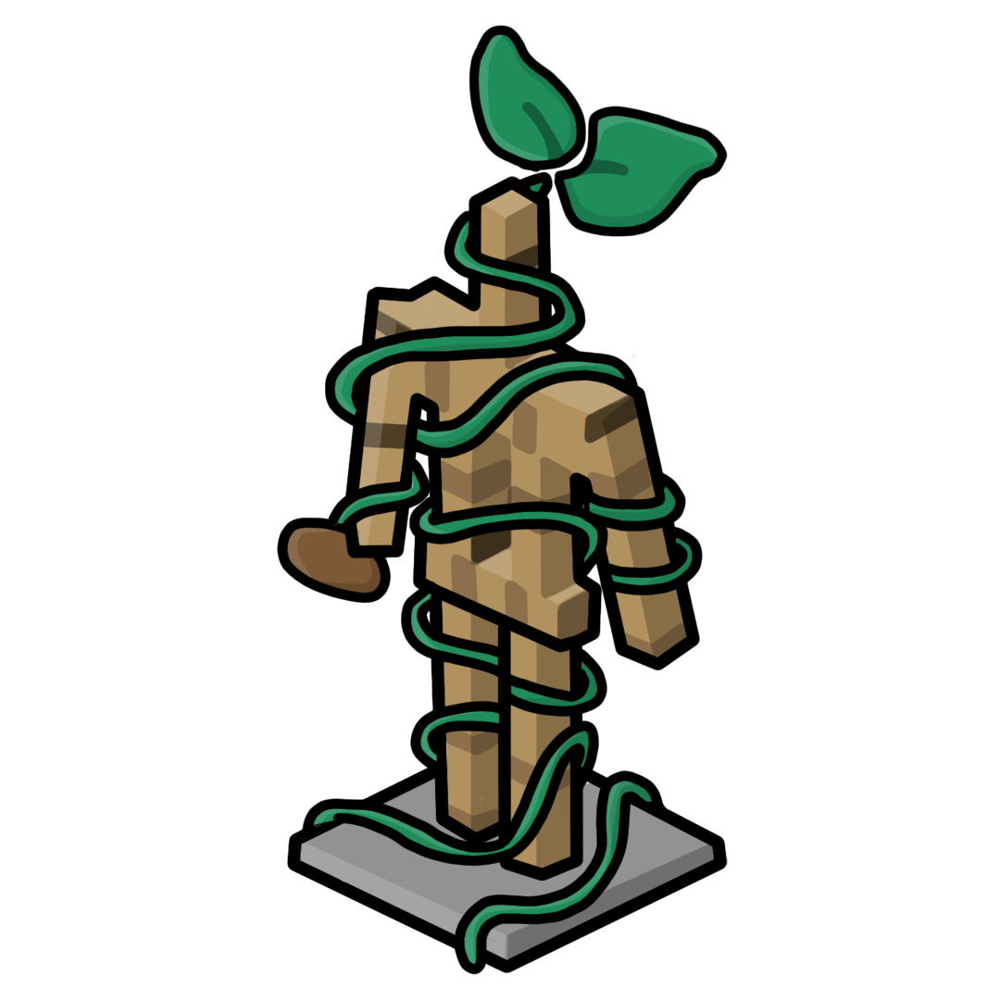

<div id="top"></div>

<!-- PROJECT SHIELDS -->
<!--
*** I'm using markdown "reference style" links for readability.
*** Reference links are enclosed in brackets [ ] instead of parentheses ( ).
*** See the bottom of this document for the declaration of the reference variables
*** for contributors-url, forks-url, etc. This is an optional, concise syntax you may use.
*** https://www.markdownguide.org/basic-syntax/#reference-style-links
-->
[![Contributors][contributors-shield]][contributors-url]
[![Forks][forks-shield]][forks-url]
[![Stargazers][stars-shield]][stars-url]
[![Issues][issues-shield]][issues-url]
[![APACHE-2.0 License][license-shield]][license-url]

<!-- PROJECT LOGO -->
<br />
<div align="center">
  <a href="https://github.com/AtlasEngineCa/WorldSeedEntityEngine">
    
  </a>

  <h3 align="center">WSEE</h3>

  <p align="center">
    WorldSeed Entity Engine
    <br />
    <br />
    <br />
    <a href="https://github.com/AtlasEngineCa/WorldSeedEntityEngine/issues">Report Bug</a>
    ·
    <a href="https://github.com/AtlasEngineCa/WorldSeedEntityEngine/issues">Request Feature</a>
  </p>
</div>

<!-- ABOUT THE PROJECT -->
## About The Project
<div align="center">
  <a href="https://github.com/AtlasEngineCa/WorldSeedEntityEngine">
    
  </a>
  </div>

This is a library that allows users to add bedrock models from blockbench in to **Vanilla Minecraft**!

WSEE lets you create multipart entities, using display entities.
The framework provided allows users to easily create multipart entities, define animations, and write AI that fully utilises the entity's animations.

Currently WSEE only supports [Minestom](https://github.com/Minestom/Minestom)

<!-- GETTING STARTED -->
## Getting Started

A full, runnable example server can be found [here](https://github.com/AtlasEngineCa/WorldSeedEntityEngine/tree/master/src/test/java)

### Adding as a dependency

Add the following to your `build.gradle.kts` file:

```
repositories {
    maven("https://reposilite.worldseed.online/public")
}
```

Add the library as a dependency
```
dependencies {
    implementation("net.worldseed.multipart:WorldSeedEntityEngine:<version>")
}
```

The lastest version number can be found [here](https://reposilite.worldseed.online/#/public/net/worldseed/multipart/WorldSeedEntityEngine)

### VM Arguments

Add the following VM arguments to your run configuration

```
--add-opens java.base/java.lang=ALL-UNNAMED
```

This is required for the molang compiler library.

## Restrictions

Some restrictions are imposed by Minecraft
- Bones must be less than 64 blocks in size

## [Wiki](https://github.com/AtlasEngineCa/WorldSeedEntityEngine/wiki)
Learn what this project is, how it works and how you can use it on your server

## FAQ

Q: Why are my bones positioned incorrectly in minecraft?\
A: Entities used for bones will be placed at the pivot point of the bone in blockbench. To fix this, move the pivot point closer to the bone

Q: Why is my model not working?\
A: Make sure you have the type set to `Bedrock Model` in blockbench

Q: Why am I getting the exception `InaccessibleObjectException`\
A: Make sure you have the VM arguments set up correctly, as described in the [Getting Started](#getting-started) section

Q: Why are `ModelDamageEvent` and `ModelInteractEvent` not triggering?\
A: You need to create hitboxes for the model [Hitboxes](https://github.com/AtlasEngineCa/WorldSeedEntityEngine/wiki/Bone-Types#hitbox)

## Comparisons
| Feature                                                                                                                          | Minestom Support | Paper Support | Math Animations | Cube Rotation   | Hurt Colour         | Accurate Hitboxes |
|----------------------------------------------------------------------------------------------------------------------------------|------------------|---------------|----------------|-----------------|---------------------|-------------------|
| [WSEE](https://github.com/AtlasEngineCa/WorldSeedEntityEngine)                                                                   | ✔️               | ❌            | ✔️             | ✔️ any          | ✔️ Texture Swapping | ✔️                 |
| [Model Engine](https://mythiccraft.io/index.php?resources/model-engine%E2%80%94ultimate-entity-model-manager-1-16-5-1-20-4.389/) | ️❌              | ✔️            | ❌             | ❌ 22.5 multiple | ❌ Leather Armour    | ❌                 |
| [hephaestus-engine](https://github.com/unnamed/hephaestus-engine)                                                                | ✔️               | ✔️            | ❌              | ❌ 22.5 multiple | ❌ Leather Armour    | ❌                 |

<p align="right">(<a href="#top">back to top</a>)</p>

<!-- MARKDOWN LINKS & IMAGES -->
<!-- https://www.markdownguide.org/basic-syntax/#reference-style-links -->
[contributors-shield]: https://img.shields.io/github/contributors/AtlasEngineCa/WorldSeedEntityEngine.svg?style=for-the-badge
[contributors-url]: https://github.com/AtlasEngineCa/WorldSeedEntityEngine/graphs/contributors
[forks-shield]: https://img.shields.io/github/forks/AtlasEngineCa/WorldSeedEntityEngine.svg?style=for-the-badge
[forks-url]: https://github.com/othneildrew/Best-README-Template/network/members
[stars-shield]: https://img.shields.io/github/stars/AtlasEngineCa/WorldSeedEntityEngine.svg?style=for-the-badge
[stars-url]: https://github.com/AtlasEngineCa/WorldSeedEntityEngine/stargazers
[issues-shield]: https://img.shields.io/github/issues/AtlasEngineCa/WorldSeedEntityEngine.svg?style=for-the-badge
[issues-url]: https://github.com/AtlasEngineCa/WorldSeedEntityEngine/issues
[license-shield]: https://img.shields.io/github/license/AtlasEngineCa/WorldSeedEntityEngine?style=for-the-badge
[license-url]: https://github.com/AtlasEngineCa/WorldSeedEntityEngine/blob/master/LICENSE
